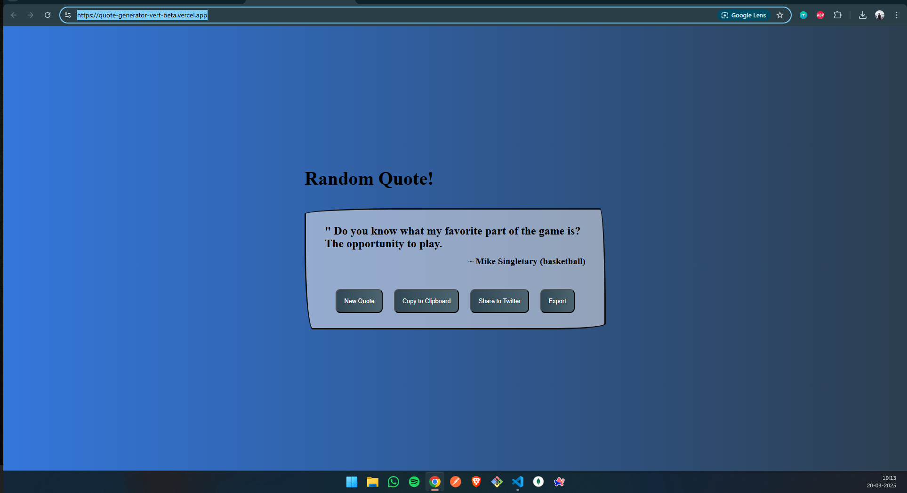

# RANDOM QUOTE GENERATOR

### This file contains a Random Quote Generator developed using Vanilla JavaScript and some third party API's like Twitter intent, html2canvas and a open sourse Api name as FreeApi from where we have to fetch the random quotes.

##  APPLICATION FEATURES:-

### - New Quote Button:- Fetch a New Quote when user clicks on the button.
### - Copy to Clipboard:- User can click on the button and the quote being displaye there is copied on their clipboard.
### -  Share to Twitter:- Once click on this button user will redirected to their twitter account and create a post which contains the Quote along with their author.
### - Export Image / Save Image:- Once click on this button a screenshot is captured using Html2Canvas which basically capture the HTML DOM structure and paint it on the canvas and finally create a image of this.

## Deployment Link:- https://quote-generator-vert-beta.vercel.app/

## Screenshot of the website:-

### -If you like the solution or find this useful please star the repository.